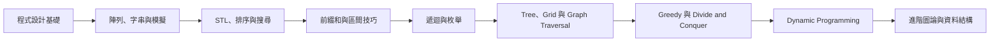

# APCS 課程路線（C++）

本文件作為 C++ 版本 APCS 與競賽程式設計課程的備課順序依據。單元依先備知識排列；前半段對應 APCS 各級能力，後半段銜接進階競程。

---

## 階段 0：程式設計基礎

### 0.1 C++ 程式結構與輸入輸出

- `#include`、`using namespace std`、`main()`
- `cin`、`cout`
- 多筆資料輸入與基本格式化輸出

### 0.2 變數、資料型態與運算

- `int`、`long long`、`double`、`char`、`string`、`bool`
- 常數、變數、指定與型別轉換
- 算術、比較、邏輯與基本位元運算
- 整數除法、餘數與 overflow

### 0.3 流程控制

- `if` / `else` 與巢狀判斷
- `for`、`while`
- `break`、`continue`

### 0.4 函式與模組化

- 函式宣告、定義、參數與回傳值
- pass by value、pass by reference
- 變數作用域

### 0.5 程式追蹤、測試與除錯

- trace table、debugger、print debugging
- 邊界測資
- 陣列越界、未初始化變數、無窮迴圈與 overflow

### 0.6 複雜度入門

- 輸入範圍與運算次數
- `O(1)`、`O(N)`、`O(N²)`
- 時間與空間使用量的基本判斷

---

## 階段 1：陣列、字串與模擬

### 1.1 一維陣列與 `vector`

- 宣告、初始化、索引與遍歷
- 累加、計數、最大值與最小值
- 資料搬移與區間處理

### 1.2 二維陣列與 Grid

- 矩陣、row / column
- 座標、邊界、上下左右移動
- 方向陣列

### 1.3 字元與字串

- 字串輸入、遍歷、比較與修改
- ASCII、字元判斷、字元和數字轉換
- substring 與字串重組

### 1.4 基礎模擬

- 依規則更新狀態
- 時間、事件、遊戲、移動與排隊模擬
- 環狀索引
- 多個狀態的同步更新

### 1.5 自訂資料型態

- `struct`
- `pair`
- 使用物件表示一筆資料

---

## 階段 2：STL、排序與搜尋

### 2.1 Sorting

- `sort()`、升冪與降冪排序
- `pair` / `tuple` 排序
- custom comparator、lambda function、多條件排序

### 2.2 基礎搜尋

- 線性搜尋
- Binary Search、搜尋區間與單調性
- `lower_bound`、`upper_bound`

### 2.3 集合與統計

- `set`、`map`
- `unordered_set`、`unordered_map`
- 次數統計、去除重複與存在性查詢

### 2.4 Stack

- LIFO
- `push`、`pop`、`top`
- 括號匹配、運算式與巢狀結構

### 2.5 Queue 與 Deque

- FIFO
- `push`、`pop`、`front`
- `push_front`、`push_back`、`pop_front`、`pop_back`
- 排隊模擬與 BFS 先備概念

### 2.6 Priority Queue

- Heap、最大堆與最小堆
- `push`、`pop`、`top`
- 維護目前最大／最小候選

---

## 階段 3：陣列前處理與區間技巧

### 3.1 一維前綴和

- Prefix Sum
- 區間總和查詢
- 前處理與查詢複雜度

### 3.2 二維前綴和

- 矩形區域總和
- Inclusion–Exclusion

### 3.3 一維差分

- 區間加值
- 差分還原
- Range Update

### 3.4 二維差分

- 矩形區域修改
- 二維差分還原

### 3.5 Two Pointers 與 Sliding Window

- 左右指標與排序後搜尋
- 固定長度、可變長度窗口
- 維護合法連續區間

### 3.6 座標壓縮

- 保留相對順序
- 將大型值域映射為連續索引

---

## 階段 4：遞迴、枚舉與搜尋空間

### 4.1 Recursion

- base case、recursive case
- call stack
- 遞迴函式的回傳值

### 4.2 Enumeration

- 多層迴圈枚舉
- 子集合、排列、組合
- bitmask enumeration

### 4.3 Backtracking 與 Pruning

- 選擇、遞迴、撤銷選擇
- 搜尋樹
- 提前終止、排除不可能狀態與上下界估計

### 4.4 搜尋複雜度

- `2^N`、`N!`
- 分支數與搜尋深度

---

## 階段 5：Tree、Grid 與 Graph Traversal

### 5.1 Binary Tree

- root、parent、child、leaf
- depth、height、subtree
- 左右子節點的陣列表示
- preorder、inorder、postorder
- 遞迴計算子樹資訊

### 5.2 一般 Tree

- children list、adjacency list
- parent、depth、subtree size
- Tree DFS

### 5.3 Grid DFS

- Grid 作為隱含圖
- 邊界、障礙與 visited
- Flood Fill、Connected Components
- 迷宮與區域遍歷

### 5.4 Graph 基礎

- vertex、edge
- directed / undirected graph
- adjacency list、visited array
- Graph DFS 與連通性

### 5.5 BFS

- Queue 與 layer
- Grid BFS、Graph BFS
- 無權圖最短路
- 多源 BFS

### 5.6 DAG 與拓樸排序

- Directed Acyclic Graph
- dependency、indegree
- Kahn's Algorithm

---

## 階段 6：Greedy 與 Divide and Conquer

### 6.1 Greedy 基礎

- greedy choice、optimal substructure
- 排序後依序選擇
- 使用 Priority Queue 維護候選

### 6.2 常見 Greedy 類型

- 活動安排、區間選擇
- 排程問題
- 每次取最大／最小候選

### 6.3 Greedy 正確性

- exchange argument
- stay-ahead argument
- 反證法與反例分析

### 6.4 Divide and Conquer

- 分割、遞迴處理與合併答案
- recursion tree、recurrence relation

### 6.5 Merge Sort 與分治應用

- Merge Sort 與 `O(N log N)`
- inversion count
- 區間統計

---

## 階段 7：Dynamic Programming

### 7.1 DP 基礎

- state、transition、initialization
- 計算順序與答案位置
- memoization、bottom-up

### 7.2 Linear DP

- Fibonacci 型遞推
- 最大子段和
- 選或不選、打家劫舍型問題

### 7.3 Grid DP

- 二維狀態
- 路徑數量
- 最小／最大路徑成本

### 7.4 Knapsack DP

- 0/1 Knapsack
- Unbounded Knapsack
- 容量維度與更新方向

### 7.5 Sequence DP

- LCS
- LIS 基礎
- 字串與序列匹配

### 7.6 DP 優化基礎

- 空間壓縮
- 狀態數與轉移複雜度

---

## 階段 8：加權圖與進階資料結構

本階段作為 APCS 高級題與競賽程式設計的銜接。

### 8.1 Shortest Path

- 加權圖
- Dijkstra
- 非負邊權限制
- adjacency list + priority queue

### 8.2 Minimum Spanning Tree 與 DSU

- Spanning Tree、Kruskal、Edge Sorting
- Find、Union
- Path Compression、Union by Size / Rank

### 8.3 Fenwick Tree

- Prefix Query
- Point Update
- Range Sum Query

### 8.4 Segment Tree

- Range Query
- Point Update
- Lazy Propagation 與 Range Update

### 8.5 Tree DP

- 以子樹定義狀態
- Postorder 計算
- 合併子節點資訊

---

## APCS 等級與課程階段對照

| APCS 程度 | 主要課程階段 |
| --- | --- |
| 初級 | 階段 0：輸入輸出、運算、條件與迴圈 |
| 中級 | 階段 1：陣列、字元、字串與模擬 |
| 中高級 | 階段 2、4、5：基礎資料結構、遞迴、枚舉、Tree、Grid、DFS/BFS 與搜尋 |
| 高級 | 階段 3、6、7，以及階段 5 的圖論：複雜度、Greedy、Divide and Conquer、DP 與 Graph |
| 競程延伸 | 階段 8：加權圖、DSU、BIT、Segment Tree 與 Tree DP |
