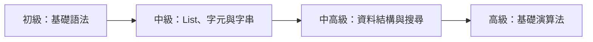

# APCS 課程路線（Python）

本路線以 APCS 公布的程式識讀與四級實作範圍為準，作為 Python 課程的備課順序。

---

## 階段 1：初級——基礎程式設計

### 1.1 輸入與輸出

- Python 程式執行順序與縮排
- `input()`、`print()`
- `split()`、`map()`
- 單筆與多筆資料輸入
- 基本格式化輸出與 f-string

### 1.2 變數與資料型態

- `int`、`float`、`str`、`bool`
- 變數指定與型別轉換
- `int()`、`float()`、`str()`

### 1.3 運算

- 算術運算
- 比較運算
- 邏輯運算
- 整數除法 `//` 與餘數 `%`
- 基本位元運算

### 1.4 條件判斷

- `if` / `elif` / `else`
- 巢狀判斷
- 複合條件

### 1.5 迴圈

- `for`、`range()`
- `while`
- 巢狀迴圈
- `break`、`continue`
- 累加、計數與狀態更新

---

## 階段 2：中級——序列、文字與模擬

### 2.1 List

- 建立、初始化與索引
- 遍歷與 `enumerate()`
- `append()`、`pop()`
- 累加、計數、最大值與最小值
- 切片
- aliasing 與二維 List 初始化

### 2.2 二維 List

- 矩陣與表格資料
- row / column
- 二維索引與遍歷
- 座標與邊界判斷

### 2.3 字元與字串

- 字串索引、切片與遍歷
- 字串比較與修改後重組
- `ord()`、`chr()`
- 字元與數字轉換
- `split()`、`join()`、`find()`、`replace()`

### 2.4 流程模擬

- 依題意逐步更新狀態
- 時間與事件推進
- 移動、遊戲與排隊模擬
- 環狀索引
- 多個狀態的同步更新

---

## 階段 3：中高級——基礎資料結構與搜尋

### 3.1 函式

- `def`
- 參數與回傳值
- local / global scope
- mutable 與 immutable 物件
- 將重複流程拆成函式

### 3.2 遞迴

- base case
- recursive case
- call stack
- 遞迴函式的回傳值
- Python recursion limit

### 3.3 Stack

- LIFO
- 使用 List 的 `append()`、`pop()`
- 括號匹配
- 巢狀結構與運算流程

### 3.4 Queue

- FIFO
- `collections.deque`
- `append()`、`popleft()`
- 排隊處理
- BFS 的先備概念

### 3.5 資料紀錄

- `tuple`
- tuple unpacking
- 使用 List、Tuple 或 Dictionary 表示一筆多欄位資料

### 3.6 排序

- `sorted()` 與 `list.sort()`
- 升冪與降冪
- `key=` 與多條件排序

### 3.7 枚舉

- 多層迴圈枚舉
- 子集合、排列與組合的基本概念
- 遞迴枚舉
- Backtracking：選擇、遞迴、撤銷

### 3.8 Binary Search

- 排序資料與搜尋範圍
- Binary Search
- 單調性
- `bisect_left()`、`bisect_right()`

### 3.9 Grid 與 DFS

- 二維格子作為簡單圖
- 上下左右方向
- 邊界、障礙與 visited
- DFS
- Flood Fill
- Connected Components

### 3.10 簡單 Tree

- root、parent、child、leaf
- depth、subtree
- Binary Tree
- preorder、inorder、postorder
- 以 List 儲存子節點

---

## 階段 4：高級——基礎演算法

### 4.1 複雜度分析

- 從輸入限制估計可接受的運算量
- `O(1)`、`O(N)`、`O(N log N)`、`O(N²)`
- 時間複雜度與空間複雜度
- Python 常用容器操作的成本

### 4.2 Tree

- adjacency list
- Tree DFS
- parent、depth、subtree size
- 由子樹答案合併整棵樹的答案

### 4.3 Graph

- vertex、edge
- directed / undirected graph
- adjacency list
- DFS 與 BFS
- 連通性
- 無權圖最短路

### 4.4 Greedy

- greedy choice
- 排序後依序選擇
- 區間與排程類問題
- 交換論證與反例

### 4.5 Divide and Conquer

- 分割問題
- 遞迴處理子問題
- 合併答案
- Merge Sort
- 基本遞迴複雜度

### 4.6 Dynamic Programming

- state、transition、initialization、answer
- memoization 與 bottom-up
- 一維 DP
- 二維／Grid DP
- 基礎序列 DP
- 狀態數與轉移複雜度

---

## 程式識讀貫穿內容

程式識讀不另排在最後，應穿插於所有階段：

- Code Tracing：逐行追蹤變數、條件、迴圈與函式
- Code Completion：依上下文補齊條件、運算式或程式片段
- Testing and Debugging：找出邊界、索引、型別與流程錯誤
- Performance Analysis：判斷迴圈次數與時間／空間複雜度
- Computational Logic：解析程式所實作的規則與演算法
- 基礎 Sorting 與 Searching 的閱讀和追蹤
