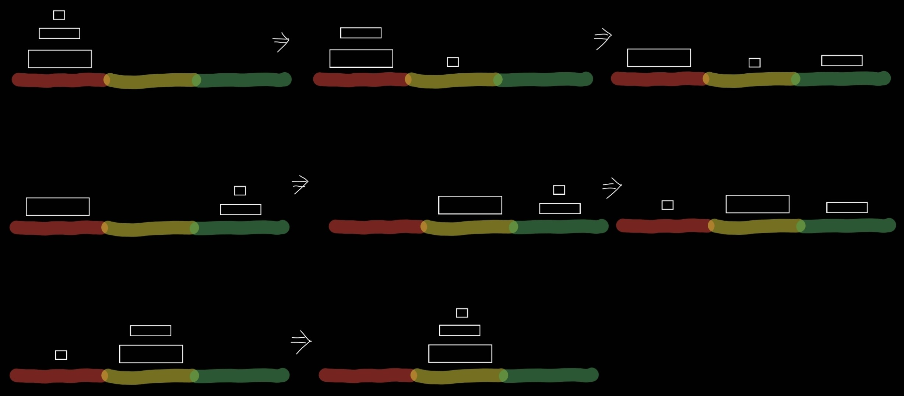

# 遞迴

我們已經學過 **函式 (Function)**，利用它可以減少重複程式碼、提升排版可讀性，並明確劃分主程式與工具模組。

當處理相對複雜、需要將大問題拆解為小問題來逐步推進時，我們就會用到 **遞迴 (Recursion)**  也就是「函式呼叫自己」的技巧。

遞迴題型的難度跨度很大：簡單的題目直觀易懂，複雜的則需要仔細推演。但在深入學習遞迴之前，我們必須先了解它的限制：未經優化的遞迴容易因為重複計算而導致執行效率低下，且呼叫深度過深時還會面臨堆疊溢位 (Stack Overflow) 的風險。

也因此，遞迴可以進一步結合記憶技術，進階為 **記憶化遞迴 (Memoization)**，甚至是完全消除遞迴開銷的 **動態規劃 (Dynamic Programming, DP)**。

---

## 1. 很基本很基本的遞迴名題：費波那契數列

給定 $f(0) = 0$ 、 $f(1) = 1$ 、 $f(2) = 1$ 、 $f(n) = f(n-2) + f(n-1)$，並依照輸入的 $k$ 值給出 $f(k)$

那遞迴的寫法很簡單：
```python
def f(n):
    if n == 0:
        return 0
    elif n == 1 or n == 2:
        return 1
    return f(n-2) + f(n-1)

k = int(input())
print(f(k))
```
我們假設路上有個怪伯伯問你請問 $f(10)$ 是多少，於是你利用了這一個程式碼。既然怪伯伯問我們第10個，我們就必須先知道 $f(9)$ 以及 $f(8)$，而如果我們需要 $f(9)$ 和 $f(8)$ 我們就必須要 $f(8)$、$f(7)$、$f(6)$
以此類推，圖示如下

```mermaid
graph TD;
    f10["f(10)"] --> f9["f(9)"];
    f10 --> f8_1["f(8)"];

    f9 --> f8_2["f(8)"];
    f9 --> f7_1["f(7)"];

    f8_1 --> f7_2["f(7)"];
    f8_1 --> f6_1["f(6)"];

    f8_2 --> f7_3["f(7)"];
    f8_2 --> f6_2["f(6)"];

    f7_1 --> f6_3["f(6)"];
    f7_1 --> f5_1["f(5)"];

    %% 下方龐大的分支用簡略點表示;
    f7_2 --> d1["... 繼續展開到 f(0)"];
    f6_1 --> d2["..."];
    f7_3 --> d3["..."];
    f6_2 --> d4["..."];
    f6_3 --> d5["..."];
    f5_1 --> d6["..."];

    style f8_1 fill:#38361c,stroke:#ffa000,stroke-width:2px
    style f8_2 fill:#38361c,stroke:#ffa000,stroke-width:2px
```



在你算完之前，怪伯伯消失了，因為算太慢了。
這不重要，重要的是圖中兩個螢光處是重複的，可是重複了我們卻又多算了好多次。
而這正是 **沒有優化過的遞迴會出現的狀況**

可惜的是這一個markdown我還不想告訴你怎麼優化 (應該會在其他篇介紹) ，總而言之，我們學會了遞迴的結構了，我們可以多看幾題。

## 2. GEMINI推薦的下一題：階乘

數學上的階乘定義為 $n! = n \times (n-1) \times (n-2) \times \dots \times 1$，且規定 $0! = 1$。
而這題開始，我們要引入兩個觀念：
* 1. Base Case (終止條件)
* 2. Recursive Step (遞迴關係)

既然數學上設定了 $0!$、$1!$，我們遇到當 $n = 0$ 或 $n = 1$ 時，答案直接就是 $1$。便可以直接return 這便是 **終止條件**

對於這題，我們想要算 $n!$，就是把 $n$ 乘以 $(n-1)!$ 的結果。
固然這樣的關係是**遞迴關係**

那基本上遞迴的題型只要知道這兩個便可以完成(應該啦)

```python
def factorial(n):
    # 1. 終止條件 (Base Case)
    if n == 0 or n == 1:
        return 1
    
    # 2. 遞迴呼叫 (Recursive Step)
    return n * factorial(n - 1)

n = int(input())
print(factorial(n))
```

## 3. 哭了，可能看到這題的眾生萬物都會哭：河內塔

作為一個正在學習程式的人，看到這個題目會哭出來。騙你的就連我也會哭出來。
河內塔是非常經典且燒腦的遞迴問題，可惜他題目看起反而比較像樂高疊疊樂而不是遞迴。

題目大致如下，三根柱子 $ABC$，$A$ 柱子上由小到大有 $n$ 個圓盤，規則是一次只能移動一個圓盤，且大圓盤不可以壓在小圓盤上面，試問在移動完第一次後，在非 $A$ 的柱子上可以重現由小到大整齊排列需要多少步。最好是給我把步驟輸出出來(之所以要這樣是因為其實有公式解可以得到步數)




好你可能看不懂這張圖，所你先去Mr.Donut買一個小、一個中、兩個大的甜甜圈，自己玩一次。**多買的那個給我吃。**

在你回來的路上，路邊的報紙上面有個名人的專欄，闡述著如何利用改變思考方式登頂人生巔峰。但你知道那大多是bullshit，因為改變思考方式不會讓你登頂巔峰，只會協助你解決河內塔這個問題。

我們常常走一步算一步考慮東考慮西，但這樣寫出來的方式太過於繁瑣，你的程式會完全寫不出來。
這時候，不管你是自己想到還是跑去問AI假裝自己有懂：我們可以想想剛剛介紹的 **終止條件** 和 **遞迴呼叫**。

假設要把 $n$ 個盤子 從 柱子 $A$ (來源) 搬到 柱子 $C$ (目標)，
我們便需要 **先把** $n-1$**個盤子放在** $B$ **(中繼)** 、接著把 $n$ **移到** $C$ 、**再把** $B$ **上的移到** $C$  **(而這不也就等於第一句話嗎!)**

你會發現這簡單的三個變換思維邏輯，我們找出了**遞迴呼叫**和**終止條件**。

* 如果 n == 1 我們就直接將其 從**來源**移到**目標**
* 如果 n != 1 我們就需要移動 $n-1$ 從**來源**到**中繼** 
* 而這也代表我們最後需要將 $n-1$ 從**中繼**移到**目標**

```python
def hanoi(n, src, target, aux):
    # 終止條件：只剩 1 個盤子時，直接搬移
    if n == 1:
        print(f"將盤子 1 從 {src} 搬到 {target}")
        return
    
    # 步驟 1：把上方 n-1 個盤子，從 src 搬到 aux（借用 target）
    hanoi(n - 1, src, aux, target)
    
    # 步驟 2：搬動最底下的第 n 個大盤子
    print(f"將盤子 {n} 從 {src} 搬到 {target}")
    
    # 步驟 3：把 aux 上的 n-1 個盤子，搬到 target（借用 src）
    hanoi(n - 1, aux, target, src)

# 測試：3 個盤子，從 A 搬到 C，借助 B
hanoi(3, 'A', 'C', 'B')
```

**對 就這幾行 然後我們早已經被嚇哭了**

我把結果放這
```text
將盤子 1 從 A 搬到 C
將盤子 2 從 A 搬到 B
將盤子 1 從 C 搬到 B
將盤子 3 從 A 搬到 C
將盤子 1 從 B 搬到 A
將盤子 2 從 B 搬到 C
將盤子 1 從 A 搬到 C
```

這時候你再回去看程式碼，稍微比較沒有那麼可怕了一點。而這正是遞迴的威力。
我們往往不需寫出所有情況或是赤腳走過所有路徑，只需要簡單幾個遞迴呼叫、終止條件，我們就能很好的完成複雜的遞迴問題。

題外話：
河內塔的故事是如果有僧侶可以真的徒手完成64座河內塔，世界將迎來和平之類的。

公式為 $2^n - 1$ 次。
如果你是高三生你的數學作業裡面照道理有推演過程
$n = 64$ 時（傳說中僧侶搬的數量），需要 $2^{64} - 1 \approx 1.84 \times 10^{19}$ 步，就算一秒搬一步也要花上 5800 億年！
所以我猜那個拿出河內塔的八成是惡魔，看來是不想天下太平。(難怪我們會嚇哭)。


* 時間複雜度：$O(2^n)$ 
* 空間複雜度：$O(n)$ —— 系統 Call Stack（呼叫堆疊）最多同時留存 $n$ 層深度。


至於**遞迴如何優化**，我們在其他的md中再討論。
去享用你的大中小甜甜圈吧!