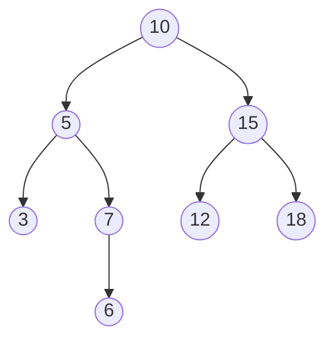
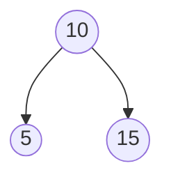

# 二元搜尋樹

## 1.你剛有沒有先看過物件導向那個md

根據那個md的最後一個練習，我們建立了一個二元搜尋樹。



## 2. 拜訪

對於這個二元搜尋樹，常見三種拜訪方式：**前序**、**中序**、**後序**。

所謂的「拜訪」，簡單來說就是：

> 我們要用什麼順序，把樹上的每一個節點都走過一次？

三種拜訪方式的差別，其實只有一件事：

**根節點什麼時候處理？**

假設現在有一棵最簡單的樹：



### 前序 Preorder

順序是：

**根 → 左 → 右**

所以：

```text
10 → 5 → 15
```

也就是一到達某個節點，就先處理自己，再去拜訪左邊和右邊。

---

### 中序 Inorder

順序是：

**左 → 根 → 右**

所以：

```text
5 → 10 → 15
```

先把左邊處理完，再處理自己，最後處理右邊。

---

### 後序 Postorder

順序是：

**左 → 右 → 根**

所以：

```text
5 → 15 → 10
```

先把左右兩邊都處理完，最後才處理自己。

---

## 3. 實際走一次

回到剛剛建立的二元搜尋樹：


### 前序

**根 → 左 → 右**

```text
10 → 5 → 3 → 7 → 6 → 15 → 12 → 18
```

### 中序

**左 → 根 → 右**

```text
3 → 5 → 6 → 7 → 10 → 12 → 15 → 18
```

有沒有發現一件很酷的事情？

**中序拜訪二元搜尋樹，會剛好按照數字由小到大排列。**

### 後序

**左 → 右 → 根**

```text
3 → 6 → 7 → 5 → 12 → 18 → 15 → 10
```

## 4. 實作 (Python)

```python
# 建立樹
################################################# 
n = int(input())

class Node:
    def __init__(self, num):
        self.num = num
        self.l = None
        self.r = None

lst = [int(x) for x in input().split()]

st = Node(lst[0])

for i in range(1, n):
    cur = st

    while True:
        if cur.num < lst[i]:
            if cur.r is None:
                cur.r = Node(lst[i])
                break
            else:
                cur = cur.r
        else:
            if cur.l is None:
                cur.l = Node(lst[i])
                break
            else:
                cur = cur.l
################################################# 

# 拜訪 (preorder 根 左 右)
################################################# 
def preorder(cur):
    if cur is None:
        return

    print(cur.num, end = " ") #根
    preorder(cur.l) #左
    preorder(cur.r) #右
################################################# 

# 拜訪 (inorder 左 根 右)
################################################# 
def inorder(cur):
    if cur is None:
        return

    inorder(cur.l) #左
    print(cur.num, end = " ") #根
    inorder(cur.r) #右
################################################# 

# 拜訪 (postorder 左 右 根)
################################################# 
def postorder(cur):
    if cur is None:
        return

    postorder(cur.l) #左
    postorder(cur.r) #右
    print(cur.num, end = " ") #根
################################################# 

preorder(st)
print("")
inorder(st)
print("")
postorder(st)
print("")
```

```text
10 5 3 7 6 15 12 18
3 5 6 7 10 12 15 18
3 6 7 5 12 18 15 10
```

## 5. 實作 (C++)
```c++
#include <bits/stdc++.h>
using namespace std;
using ll = long long;


// 建立 Node
// ----------------------------------------------------
class Node
{
public:
    ll num;
    Node* l;
    Node* r;

    Node(ll num)
    {
        this->num = num;
        this->l = nullptr;
        this->r = nullptr;
    }
};
// ----------------------------------------------------


// 前序 preorder：根 左 右
// ----------------------------------------------------
void preorder(Node* cur)
{
    if (cur == nullptr)
    {
        return;
    }

    cout << cur->num << " ";
    preorder(cur->l);
    preorder(cur->r);
}
// ----------------------------------------------------


// 中序 inorder：左 根 右
// ----------------------------------------------------
void inorder(Node* cur)
{
    if (cur == nullptr)
    {
        return;
    }

    inorder(cur->l);
    cout << cur->num << " ";
    inorder(cur->r);
}
// ----------------------------------------------------


// 後序 postorder：左 右 根
// ----------------------------------------------------
void postorder(Node* cur)
{
    if (cur == nullptr)
    {
        return;
    }

    postorder(cur->l);
    postorder(cur->r);
    cout << cur->num << " ";
}
// ----------------------------------------------------


int main()
{
    ll n;
    cin >> n;

    ll a;
    cin >> a;

    Node* st = new Node(a);

    for (ll i = 1; i < n; i++)
    {
        cin >> a;

        Node* cur = st;

        while (true)
        {
            if (a < cur->num)
            {
                if (cur->l == nullptr)
                {
                    cur->l = new Node(a);
                    break;
                }
                else
                {
                    cur = cur->l;
                }
            }
            else
            {
                if (cur->r == nullptr)
                {
                    cur->r = new Node(a);
                    break;
                }
                else
                {
                    cur = cur->r;
                }
            }
        }
    }

    // ----------------------------------------------------

    preorder(st);
    cout << endl;

    inorder(st);
    cout << endl;

    postorder(st);
    cout << endl;
}
```

```text
10 5 3 7 6 15 12 18
3 5 6 7 10 12 15 18
3 6 7 5 12 18 15 10
```

## 6. 練習

**手寫出來**